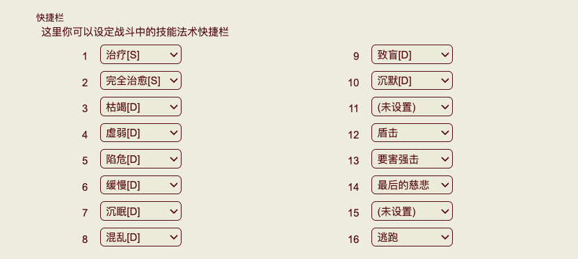
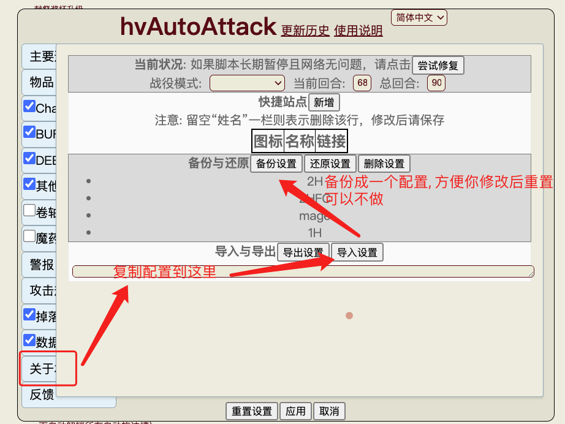
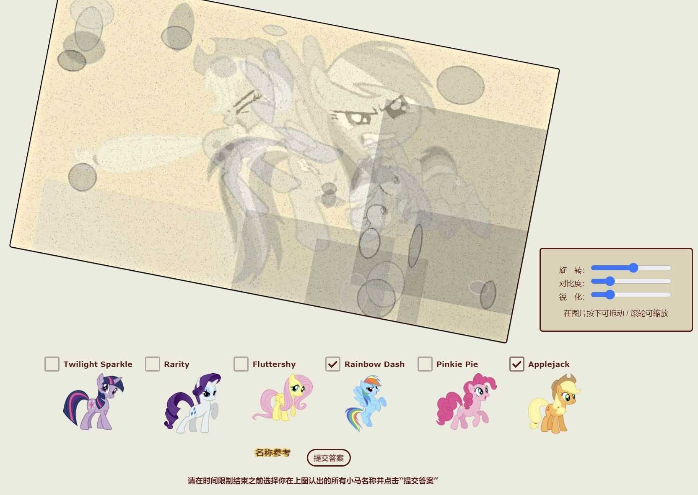
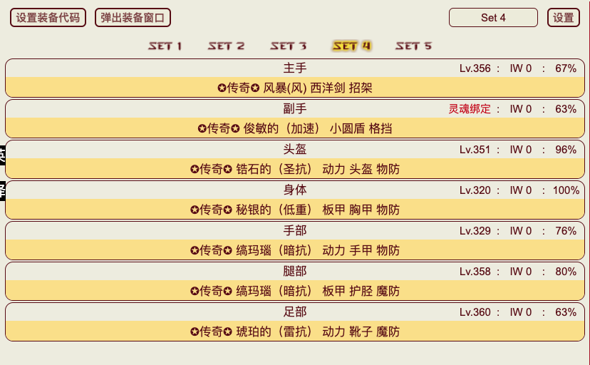
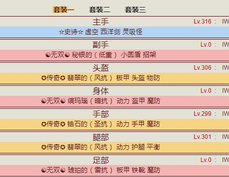
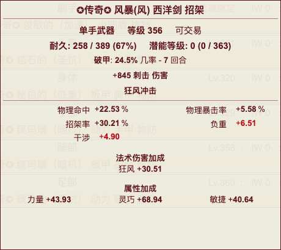

# HentaiVerse 入门教程

## 开始要做的

首先我们先不讲理论不讲系统, 先把第一时间要做的事情列举一下

1. 下脚本

- 必装
  - [HV 界面汉化](https://sleazyfork.org/zh-CN/scripts/404118-hentaiverse汉化)
  - [HV Utils 汉化](https://greasyfork.org/zh-CN/scripts/472723-hv-utils-cn)
  - [HV 自动战斗](https://github.com/dodying/UserJs/blob/master/HentaiVerse/hvAutoAttack/hvAutoAttack.user.js)
- 选装
  - [HV 战斗日志汉化](https://sleazyfork.org/zh-CN/scripts/445520-hv-战斗日志汉化)
  - [HV 抓取资源市场价格](https://github.com/monon98/hv-tool/blob/3f165d52c8801f3ba15b3d03c6da1fcddff89a1c/dist/hv-tools.js)
  - [HV 彩虹小马验证码助手](https://sleazyfork.org/zh-CN/scripts/459603-hv-彩虹小马-my-little-pony)

2. 乞讨 30w-50w Credits, 把 [市场里的小马雕像](https://hentaiverse.org/?s=Bazaar&ss=mk&screen=browseitems&filter=fi) 每一个都买一个(别买多了, 别少一个)  
   买齐之后等待 12-24 小时就可以获得一个强力技能 <小马友谊轨道炮>(Orbital Friendship Cannon)  
   下图是该技能的位置和图标

   

3. 选择战斗项目
     
    优先 AR(竞技场 Arena)  
    竞技场前 100 级基本上是每 10 级一档

   AR(竞技场 Arena) 比起 GR(压榨界 Grinder) 有四倍的掉落率, 但是等级低的时候没几个竞技场可打, GR(压榨界 Grinder) 也行  
   至于 IW(道具界 Item World), 和这些没关系, 是给装备升级的, 平常打没有意义
   所以开打!

4. 战斗页面
   
   一个标准战斗页面, 左边是自己的状态和战斗日志, 右边是敌人
   如果你打算手动打, 那要配好技能栏

   ([设置面板](https://hentaiverse.org/isekai/?s=Character&ss=se))拉到下面配置技能栏(不着急, 意义有限)
   

   或者用 [Monsterbation](https://forums.e-hentai.org/index.php?showtopic=211039) 进行手动战斗(我只是知道, 没用过, 可以试试)

   但是我们用自&动&战&斗&脚本(谨慎低调,别张扬)
    <details>
      <summary>复制这里的配置</summary>
        
      ```javascript
      {"version":"2.90","lang":"0","channelSkillSwitch":true,"buffSkillSwitch":true,"debuffSkillSwitch":true,"skillSwitch":true,"dropMonitor":true,"recordUsage":true,"hp1":50,"mp1":70,"sp1":75,"attackStatus":0,"pauseButton":true,"pauseHotkey":true,"pauseHotkeyStr":"V","pauseHotkeyCode":86,"alert":true,"encounter":true,"turnOnSS":true,"turnOnSSCondition":{"0":["_isCd_1111,5,0","oc,3,86","monsterAlive,1,1"],"1":["oc,3,220","monsterAlive,3,4"],"2":["oc,3,86","monsterAlive,2,4","monsterAlive,1,1"],"3":["bossAlive,6,0","oc,3,86"],"4":["roundType,5,'tw'","oc,3,86","monsterAlive,1,1"]},"turnOffSSCondition":{"0":["monsterAlive,5,1","monsterAll,3,6"]},"defendCondition":{"0":["hp,4,70","oc,3,150"],"1":["oc,3,250"]},"focusCondition":{"0":["hp,1,hp"]},"delayAlertTime":0,"delayReloadTime":0,"riddleAnswerTime":3,"riddlePopup":true,"staminaLose":5,"idleArenaTime":0,"idleArenaGrTime":1,"repairValue":0,"pauseCondition":{"0":["bossAlive,3,1","roundNow,1,200"],"1":["roundNow,1,100","hp,1,200"],"2":["mp,4,15"]},"staminaLow":30,"delay":20,"delay2":20,"itemOrderName":"Cure,MP,SP,HP,HE,ME,FC","itemOrderValue":"311,11295,11395,11195,11199,11299,313","itemOrder":{"Cure":true,"FC":true,"HP":true,"HE":true,"MP":true,"ME":true,"SP":true},"item":{"Cure":true,"FC":true,"HP":true,"HE":true,"MP":true,"ME":true,"SP":true},"itemCureCondition":{"0":["hp,4,40"],"1":["hp,4,60","roundNow,3,300"]},"itemFCCondition":{"0":["hp,4,10","mp,1,30"]},"itemHPCondition":{"0":["hp,4,60","bossAll,3,1"],"1":["hp,4,40","mp,2,30"]},"itemHECondition":{"0":["hp,4,5"]},"itemMPCondition":{"0":["mp,2,40"]},"itemMECondition":{"0":["mp,2,10"]},"itemSPCondition":{"0":["sp,2,30"]},"channelSkill":{"Pr":true,"SL":true,"SS":true,"He":true},"channelSkill2":true,"channelSkill2OrderName":"Cu","channelSkill2OrderValue":"311","channelSkill2Order":{"Cu":true},"buffSkillOrderValue":"SL,SS,Pr,Re,Ha,SV,He","buffSkillOrder":{"Pr":true,"SL":true,"SS":true,"Ha":true,"He":true,"Re":true,"SV":true},"buffSkill":{"HD":true,"MD":true,"SD":true,"Pr":true,"SL":true,"SS":true,"Ha":true,"He":true,"Re":true,"SV":true},"buffSkillHDCondition":{"0":["hp,2,60"]},"buffSkillMDCondition":{"0":["mp,2,75"]},"buffSkillSDCondition":{"0":["sp,2,50"]},"buffSkillPrCondition":{"0":["mp,3,10"]},"buffSkillSLCondition":{"0":["mp,3,10"]},"buffSkillSSCondition":{"0":["mp,3,20"]},"buffSkillHaCondition":{"0":["mp,3,10"]},"buffSkillHeCondition":{"0":["mp,1,40"]},"buffSkillReCondition":{"0":["mp,1,40","hp,4,80"]},"buffSkillSVCondition":{"0":["mp,3,10"]},"buffSkillAbCondition":{"0":["hp,1,60"]},"debuffSkillOrderValue":"Im,We,Dr","debuffSkillOrder":{"Im":true,"Dr":true,"We":true},"debuffSkillAllIm":true,"debuffSkillImpCondition":{"0":["monsterAlive,1,6","roundNow,1,70"],"1":["bossAll,3,4"]},"debuffSkillAllWk":true,"debuffSkillWkCondition":{"0":["bossAll,3,4"]},"debuffSkill":{"Im":true,"Dr":true,"We":true},"debuffSkillImCondition":{"0":["bossAlive,1,0","monsterAlive,2,3","roundNow,1,40"]},"debuffSkillDrCondition":{"0":["bossAlive,1,0","roundNow,1,40"]},"debuffSkillWeCondition":{"0":["bossAlive,1,0","monsterAlive,2,4","roundNow,1,40"]},"debuffSkillTurn":{"Sle":0,"Bl":0,"Slo":0,"Im":0,"MN":0,"Si":0,"Dr":0,"We":0,"Co":0},"skillOrderValue":"OFC,T1,T2","skillOrder":{"OFC":true,"T2":true,"T1":true},"skill":{"OFC":true,"T2":true,"T1":true},"skillOFCCondition":{"0":["oc,3,150"]},"fightingStyle":"2","skillT3Condition":{"0":["oc,3,200"]},"skillT2Condition":{"0":["oc,3,50"]},"skillT1Condition":{"0":["oc,3,25"]},"audioEnable":{"Common":true,"Defeat":true,"Riddle":true,"Victory":true},"audio":{"Common":"https://raw.githubusercontent.com/dodying/UserJs/master/HentaiVerse/hvAutoAttack/Error.ogg","Defeat":"https://raw.githubusercontent.com/dodying/UserJs/master/HentaiVerse/hvAutoAttack/Defeat.ogg","Riddle":"https://raw.githubusercontent.com/dodying/UserJs/master/HentaiVerse/hvAutoAttack/Error.ogg","Victory":"https://raw.githubusercontent.com/dodying/UserJs/master/HentaiVerse/hvAutoAttack/Victory.ogg"},"weight":{"Sle":5,"Bl":3,"Slo":3,"Im":-5,"MN":-4,"Si":-4,"Dr":-4,"We":-4,"Co":-1,"CM":-5,"Stun":-34,"PA":-4,"BW":-4},"dropQuality":"3","roundNow":"68","roundAll":"90"}
   ```
    </details>

   按照下图导入自动战斗的配置  
    

   这样就可以双手离开键盘, 需要过小马验证的时候过一下, 其他大多时候就能自动战斗啦~  
   不过事情肯定没有这么简单, 这个脚本是比较后期的脚本, 前期技能很少, 而且难度倍率也不容易提升上去  
   还是需要多了解其他系统, 丰富战斗选项的  
   如果想躺靠这个脚本基本就够了, 如果想研究怎么改进自动战斗的判断条件, 进而减少死亡率和减少资源消耗, 可以在 [自动战斗脚本 readme](https://github.com/dodying/UserJs/tree/master/HentaiVerse/hvAutoAttack) 这里了解学习.

5. 小马验证
   小马验证是迟早会遇到的东西, 对新手来说不是很好认, 如果实在认不出可以用 [HV 彩虹小马验证码助手](https://sleazyfork.org/zh-CN/scripts/459603-hv-彩虹小马-my-little-pony) 来辅助判断, 不过这个熟练了很简单的, 多看看就好了

   
   刚开始可能认不得, 其实找特征很快的

## 装备 & 技能

搞完了上面那些, 我们来稍微研究一下这个游戏的装备技能系统和流派

流派很多, 但是当前版本  
**300 级甚至是 400 级之前只有单手重甲剑盾走得远**

<details>
<summary>理由(可以不看, 知道结论就行)</summary>

- 装备分为 布甲(法师) 轻甲(战士) 重甲(战士)
- 法师是大后期职业, 前中期不用考虑, 而且巨花钱
- 轻甲的优势在于重量低, 辅助属性多, 缺点在于防御低
- 重甲的优势在于防御高, 缺点在于重量高, 对法力和灵力消耗比较大
- 但是从 100 多级开始, 想快速升级就要上高难度, x10 x15 x20 比较合适, 高难度下怪物伤害比较高, 活下来比伤害高重要的多, 所以重甲就是最优选
- 轻甲配合双手或者二天一流唯一的优势就是前期不能上高难度的时候能快速刷怪, 但是作用时间很有限, 所以我们直接忽略就行了

</details>

---

### 装备

既然如此, 我们直接搞 单手武器 / 盾牌 / 重甲(头 甲 手 腿 鞋) 就可以了

- 经典单手重甲盾剑
  

- <details>
    <summary><s>某布丁佬气人的装备</s></summary>

    

  </details>

---

- 单手武器: 属性重点看 XX 率, 西洋剑最优, 前缀虚空比较好, 后缀杀戮/招架最好啦
  
- 盾牌: 属性重点看格挡率, 优先力场盾, 其实盾牌种类各有优劣
  TODO: 图
- 重甲: 属性重点看物防魔防已经提供的属性, 优先动力甲, 板甲防御力高点但是不提供攻击属性, 也有 4 动力 1 板甲的搭配, 不过啥好穿啥
  TODO: 图

### 技能

TODO:
根据单手的流派, 按照技能模拟器的点发:

## 训练

TODO:

## 市场

TODO:

## 每日任务

TODO:

# 参考文献

TODO:

- [HentaiVerse wiki](https://ehwiki.org/wiki/HentaiVerse)
- [HentaiVerse 中文指引](https://forums.e-hentai.org/index.php?showtopic=189266)
